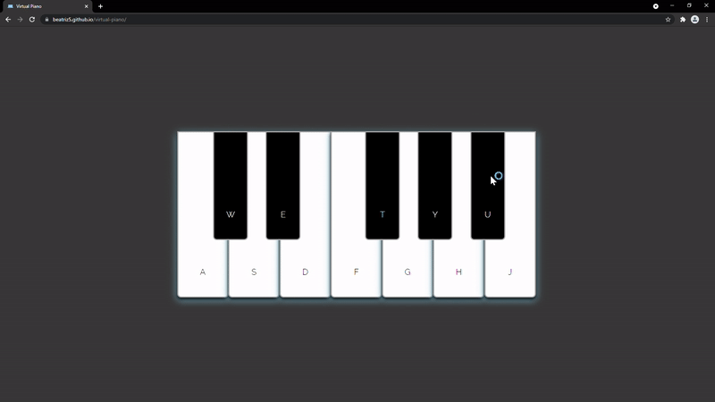

# Virtual Piano

It is a virtual piano to play through the keyboard or by clicking. When used, the key turns light blue, and the piano originates a sound. Enjoy the melody.  

## Demonstration

:loud_sound:    https://beatriz5.github.io/virtual-piano/ 

## Built With

* HTML + CSS + JavaScript
* Webstorm 2021.1.1
* Visual Studio Code

## Author

Beatriz https://github.com/beatriz5

## Acknowledgments

https://developer.mozilla.org/en-US/docs/Web/API/Element/click_event

https://ezgif.com/

https://github.com/PV-COP/PV-README-TEMPLATE/blob/master/TemplateWithInfo.md

## Key Programming Concepts Utilized

* HTML keyboard input elements.
* CSS for page styling, including display order, Google fonts, positioning properties, z-index.
* JavaScript audio objects.
* Set timeout in JavaScript. 
* Keydown and click event listeners in JS.
